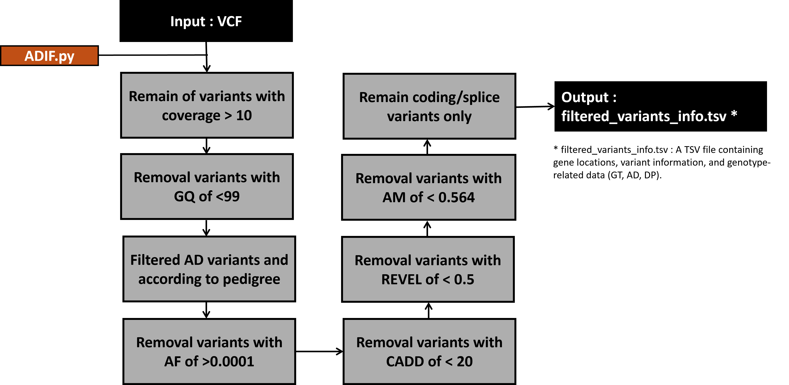

# ADIF_v1
Autosomal_Dominant_Inherited_finder

# hEDS Variant Filtering Pipeline
This repository contains a variant filtering workflow used to identify candidate variants associated with hypermobile Ehlers–Danlos syndrome (hEDS) from whole-exome sequencing (WES) data.

The pipeline integrates quality filtering, inheritance model filtering, population frequency filtering, and functional annotation to prioritize potentially relevant variants.

# Variant Calling
Germline variants were identified using the following pipeline:

Alignment: BWA-MEM
Variant calling: GATK HaplotypeCaller

Only high-quality variants were retained for downstream filtering.

# Abstract
- Advances in next-generation sequencing (NGS) technologies have greatly facilitated efforts to identify the genetic causes of rare diseases. In particular, analyses based on trio samples consisting of a patient and both parents provide an effective strategy for detecting causal variants associated with autosomal dominant disorders. However, prioritizing candidate variants consistent with an autosomal dominant inheritance pattern from trio-based VCF files requires multiple analytical steps, including variant quality filtering, evaluation of population allele frequencies, and genotype comparison among family members. These procedures can be technically demanding and time-consuming when performed manually by researchers.
 To address these challenges, we developed an automated analysis pipeline that identifies candidate variants associated with autosomal dominant rare diseases using trio VCF files as input. The pipeline sequentially performs variant quality filtering and rare variant prioritization, and subsequently identifies variants that are present in the patient in a heterozygous state and are either inherited from one or both parents or arise de novo.
 This approach enables the systematic and reproducible identification of candidate variants underlying autosomal dominant rare diseases. The pipeline aims to reduce the analytical burden on researchers while improving the efficiency and accuracy of variant discovery.

# Workflow

# Filtering Strategy
1. Quality Filtering
Initial variant filtering was applied to both datasets:

DP > 10
GQ ≥ 99

2. Chromosome Filtering
Variants located on chromosome Y were removed.

Candidate Cohort Filtering (n = 6)
Step 1 — Autosomal Dominant Inheritance Filtering
Variants consistent with an autosomal dominant inheritance model were retained.

Step 2 — Population Frequency Filtering
Variants with allele frequency ≥ 0.0001 in gnomAD East Asian (EAS) population were excluded.

Step 3 — Clinical Annotation Filtering
Variants annotated as CADD < 20, REVEL < 0.5, and AM < 0.564 were removed.

Step 4 — Functional Filtering
Only coding/splice variants were retained.

# Input Data

The pipeline requires:

Joint or merged VCF file
ClinVar annotations
gnomAD allele frequency
VEP annotation

# Output

The pipeline produces:

Filtered candidate variant list
Candidate gene list
Variants prioritized for downstream interpretation

# Requirements

Typical tools used in the workflow:

bcftools
GATK4
VEP
Linux shell utilities

# Citation
If you use this pipeline, please cite the corresponding study.

## Reference
- GATK4: Van der Auwera, G. A., & O'Connor, B. D. (2020). Genomics in the cloud: using Docker, GATK, and WDL in Terra. O'Reilly Media.
- BCFTOOLS: Danecek, P., Bonfield, J. K., Liddle, J., Marshall, J., Ohan, V., Pollard, M. O., ... & Li, H. (2021). Twelve years of SAMtools and BCFtools. Gigascience, 10(2), giab008.
- BWA-MEM2: Vasimuddin, M., Misra, S., Li, H., & Aluru, S. (2019, May). Efficient architecture-aware acceleration of BWA-MEM for multicore systems. In 2019 IEEE international parallel and distributed processing symposium (IPDPS) (pp. 314-324). IEEE.
